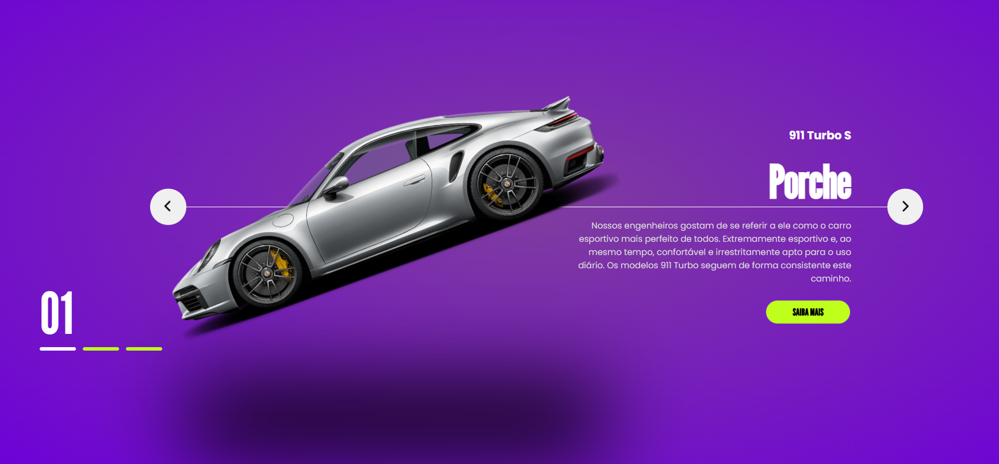

# Projeto: Página de Conversão de uma Loja de Carros




## Visão Geral
Este projeto consiste em uma página interativa de apresentação de veículos de uma loja de carros. A página permite aos usuários navegar entre diferentes modelos de carros, visualizar informações detalhadas e interagir com elementos da interface para uma experiência imersiva e moderna.

## Arquitetura do Projeto
O projeto está dividido em três camadas principais:

1. **HTML**: Responsável pela estrutura semântica do site.
   - Define os elementos principais, como o cabeçalho, o carrossel de carros e os botões de navegação.

2. **CSS**: Utilizado para estilizar os elementos e garantir uma interface visual atraente.
   - Estilização com cores modernas, gradientes radiais e animações suaves para transições de elementos.
   - Layout flexível utilizando Grid e Flexbox para alinhamento e distribuição dos elementos.

3. **JavaScript**: Implementa a interatividade e as funcionalidades dinâmicas.
   - Controle do carrossel de carros, incluindo a navegação entre os itens.
   - Atualização dos indicadores e sincronização entre os elementos visuais.

## Tecnologias Utilizadas

### Frontend
- **HTML5**: Estrutura semântica e otimização para SEO.
- **CSS3**: Estilos avançados e responsividade, utilizando:
  - Grid Layout
  - Flexbox
  - Animações e transições
- **JavaScript**: Controle da lógica de navegação no carrossel e manipulação do DOM.

### Design
- **Google Fonts**:
  - *Poppins*: Utilizada para o texto geral.
  - *League Gothic*: Utilizada para títulos e números destacados.
- **Paleta de cores**:
  - Fundo escuro com contraste em amarelo e roxo para destacar os elementos.

## Estrutura de Arquivos

```plaintext

|-- index.html       # Estrutura principal do site
|-- style.css        # Estilo e layout do site
|-- script.js        # Funcionalidades e interatividade
|-- /assets          # Imagens e ícones utilizados no projeto
    |-- logo.png     # Logotipo da loja
    |-- 1.png        # Imagem do carro Porsche
    |-- 2.png        # Imagem do carro Ferrari
    |-- 3.png        # Imagem do carro Lamborghini
    |-- arrow.png    # Ícones de navegação
```
## Acesso ao Projeto

Para acessar o projeto, clique no link abaixo:

[**Acesse o Projeto Aqui**](https://productpage-ten.vercel.app/)
